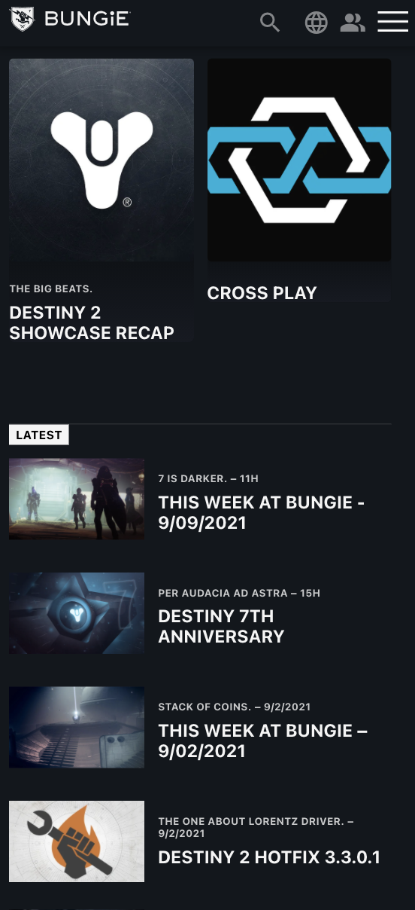

# Procesverslag
Markdown is een simpele manier om HTML te schrijven.  
Markdown cheat cheet: [Hulp bij het schrijven van Markdown](https://github.com/adam-p/markdown-here/wiki/Markdown-Cheatsheet).

Nb. De standaardstructuur en de spartaanse opmaak van de README.md zijn helemaal prima. Het gaat om de inhoud van je procesverslag. Besteedt de tijd voor pracht en praal aan je website.

Nb. Door *open* toe te voegen aan een *details* element kun je deze standaard open zetten. Fijn om dat steeds voor de relevante stuk(ken) te doen.

## Jij

uitwerken voor kick-off werkgroep

### Auteur:
Dani Buné

#### Je startniveau:
Blauwe piste

#### Je focus:
Service
 

## Je website

uitwerken voor kick-off werkgroep

### Je opdracht:
https://www.bungie.net/

#### Screenshot(s) van de eerste pagina (small screen): 
Homepage van de Bungie website 
 

#### Screenshot(s) van de tweede pagina (small screen):
Season of the lost informatie pagina

 

## Breakdownschets (week 1)

uitwerken na afloop 2e werkgroep

### Homepage breakdowbn: 

### Seasonpage breakdown: 

## Voortgang 1 (week 2)

uitwerken voor 1e voortgang

### Stand van zaken
De week van dit voortganggesprek lag ik ziek op bed met voedselvergiftiging, hier ben ik twee weken goed ziek van geweest en hier begon eigenlijk meteen al mijn achterstand voor dit vak

### Agenda voor meeting
Niet aanwezig

### Verslag van meeting
Geen feedback

- x
- x
- x
- x

## Voortgang 2 (week 3)

uitwerken voor 2e voortgang

### Stand van zaken
Tweede week dat ik ziek was

### Agenda voor meeting
Niet aanwezig

### Verslag van meeting
Geen feedback

- x
- x
- x
- x

## Toegankelijkheidstest (week 4)

uitwerken na test in 8e voortgang

### Bevindingen
Lijst met je bevindingen die in de test naar voren kwamen:

#### Titel eerste bevinding
Hier korte omschrijving (met indien nodig een afbeelding)

Hier een omschrijving van hoe het opgelost kan worden (met indien nodig een afbeelding)

#### Titel tweede bevinding. 
Hier korte omschrijving (met indien nodig een afbeelding)

Hier een omschrijving van hoe het opgelost kan worden (met indien nodig een afbeelding)

#### Titel volgende bevinding. 
Hier korte omschrijving (met indien nodig een afbeelding)

Hier een omschrijving van hoe het opgelost kan worden (met indien nodig een afbeelding)

#### Titel nog een bevinding. 
Hier korte omschrijving (met indien nodig een afbeelding)

Hier een omschrijving van hoe het opgelost kan worden (met indien nodig een afbeelding)

## Voortgang 3 (week 4)

uitwerken voor 3e voortgang

### Stand van zaken
Ik had hier op dat moment de hoop voor FeD opgegeven, mijn focus heb ik toen op mijn andere vakken gelegd en heb dit compleet laten schieten

### Agenda voor meeting
Niet aanwezig

### Verslag van meeting
Geen feedback

- x
- x
- x
- x

## Eindgesprek (week 5)

uitwerken voor eindgesprek

### Stand van zaken
Eerste beoordeling had ik nog niks gemaakt dus ik was hier niet aanwezig

### Screenshot(s)

X

## Herkansing

uitwerken voor eindgesprek

### Stand van zaken
Laatste week van het blok en al mijn andere vakken had ik al ingeleverd en ik heb toen besloten om gewoon te gaan proberen een website te maken voor FeD. Het hele idee was een longshot aangezien ik maar twee dagen ervoor zou hebben maar ik ging het gewoon proberen, maakt me niet uit of ik zou halen of niet.

### Screenshot(s)

Screenshots woensdag einde ochtend (10/11/2021)    

Screenshots woensdag avond (10/11/2021)    
Homepage:    

Screenshots donderdag ochtend (11/11/2021)    
Seasonpage    

Screenshots donderdag middag (11/11/2021)    
Homepage    

Seasonpage    

## Bronnenlijst

continu bijhouden terwijl je werkt

Nb. Wees specifiek ('css-tricks' als bron is bijv. niet specifiek genoeg).

1. https://css-tricks.com/snippets/css/a-guide-to-flexbox/
2. https://stackoverflow.com/questions/2751127/how-to-select-the-first-second-or-third-element-with-a-given-class-name
3. https://stackoverflow.com/questions/36350948/removing-black-dots-from-li-and-ul
4. https://www.w3schools.com/css/css_positioning.asp
5. https://stackoverflow.com/questions/29973357/how-do-you-format-code-in-visual-studio-code-vscode
6. https://developer.mozilla.org/en-US/docs/Web/CSS/border
7. https://developer.mozilla.org/en-US/docs/Web/HTML/Element
8. https://developer.mozilla.org/en-US/docs/Web/HTML/Element/time
9. https://developer.mozilla.org/en-US/docs/Web/CSS/background-size
10. https://developer.mozilla.org/en-US/docs/Web/CSS/fit-content
11. https://developer.mozilla.org/en-US/docs/Web/CSS/text-emphasis?retiredLocale=nl
12. https://developer.mozilla.org/en-US/docs/Web/HTML/Element/strong
13. https://www.freecodecamp.org/news/how-to-center-an-image-in-css/
14. https://developer.mozilla.org/en-US/docs/Web/API/Element/closest
15. https://careerkarma.com/blog/css-bold/
16. https://stackoverflow.com/questions/26032089/in-html-how-can-i-have-text-that-is-only-accessible-for-screen-readers-i-e-fo

